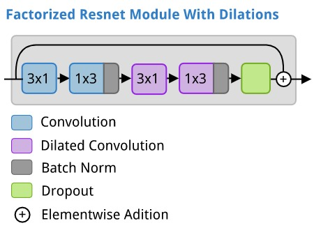
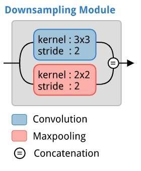
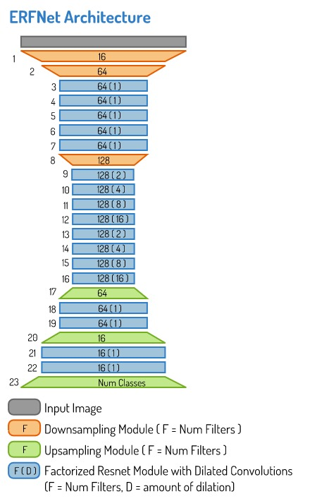

This repository contains a Tensorflow implementation of a semantic segmentation model that came out in 2017 called the Efficient Residual Factorized Network (ERFNet) ([Romera et al 2017a][romera2017a], [Romera et al 2017b][romera2017b]). This architecture combines the ideas from several high performing deep neural network architectures in order to create an efficient, and powerful model for the semantic segmentation task.

There is a report associated with this repository, it can be checked out [here](http://ronny.rest/portfolio/erfnet_seg)

# The Architecture

The ERFNet architecture makes use of three different modules that it stacks together.

1. A factorized residual network module with dilations.
2. A downsampling module inspired by an inception module.
3. An upsampling module.

Each of these is illustrated below.





The **upsamling module** is just a fractionally strided convolution (aka inverse convolution, or deconvolution).

## Complete Architecture

The ERFNet combines the above modules in the following arangement.




# Get the data

The data used to train the model in this repository is the Camvid Dataset.

- [camvid dataset page](http://web4.cs.ucl.ac.uk/staff/g.brostow/MotionSegRecData/)

Each of the files can be downloaded using:

```sh
LABEL_MAP_URL=http://web4.cs.ucl.ac.uk/staff/g.brostow/MotionSegRecData/data/label_colors.txt
LABELS_URL=http://web4.cs.ucl.ac.uk/staff/g.brostow/MotionSegRecData/data/LabeledApproved_full.zip
IMAGES_URL=http://web4.cs.ucl.ac.uk/staff/g.brostow/MotionSegRecData/files/701_StillsRaw_full.zip

wget -c $LABEL_MAP_URL

wget -c $LABELS_URL
unzip -d train_labels LabeledApproved_full.zip

wget -c $IMAGES_URL
unzip 701_StillsRaw_full.zip
mv 701_StillsRaw_full train_inputs
```

# Process the Data
To convert all the images into numpy arrays, and store them in a single pickle file for convenience. Simply go into the `data_processing.py` file and modify the line that says:

```py
data_dir = "/path/to/camvid"
```

And change the path to the base directory you saved the camvid files to (it should contain `train_inputs` and `train_labels` subdirectories).

Now run the `data_processing.py` file, eg through the command line using the following command.

```sh
python data_processing.py
```

This will create a pickle file (about 220MB) with all the data in the same directory that this repository was saved in.

# Training
GO into the bottom of the `train.py` file to modify any details about the training, eg, to change the name of the model, or learning rates, how often visualizations are created, the data input shapes, etc.

Now you can train a model by running the train.py file, eg, by running the following command:

```sh
python train.py
```

This will create a subdirectory called `models`, with a further subdirectory for the name of each model you train.

The subdirectory for each model will contain two different snapshots. One that is saved at the end of each epoch of training, and one that is saved if its IOU score on the validation data is the highest so far (ie, the best version of the model so far).

You will also find visualizations of the training curves, and samples of the predicted segmentations on training data and validation data.


[paszke2016]: https://arxiv.org/abs/1606.02147
[romera2017a]: http://www.robesafe.uah.es/personal/eduardo.romera/pdfs/Romera17iv.pdf
[romera2017b]: http://www.robesafe.uah.es/personal/eduardo.romera/pdfs/Romera17tits.pdf
[inceptionv1]: https://arxiv.org/abs/1409.4842v1
[inceptionv2]: https://arxiv.org/abs/1512.00567v3
[resnet]: https://arxiv.org/abs/1512.03385
[yu_koltun_2015]: https://arxiv.org/abs/1511.07122
