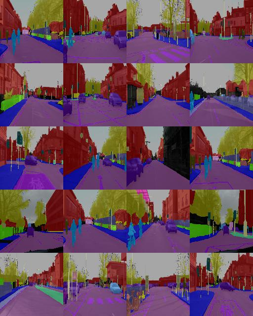

# Exploring the Camvid dataset

```py

```


# Data Exploration

The dataset contains 701 samples. The input images are RGB png images with dimensions of `960x720`. The label images are also encoded in RGB with the following RGB color mappings:

```py
label_colormap = {
    "Animal": (64, 128, 64),
    "Archway": (192, 0, 128),
    "Bicyclist": (0, 128, 192),
    "Bridge": (0, 128, 64),
    "Building": (128, 0, 0),
    "Car": (64, 0, 128),
    "CartLuggagePram": (64, 0, 192),
    "Child": (192, 128, 64),
    "Column_Pole": (192, 192, 128),
    "Fence": (64, 64, 128),
    "LaneMkgsDriv": (128, 0, 192),
    "LaneMkgsNonDriv": (192, 0, 64),
    "Misc_Text": (128, 128, 64),
    "MotorcycleScooter": (192, 0, 192),
    "OtherMoving": (128, 64, 64),
    "ParkingBlock": (64, 192, 128),
    "Pedestrian": (64, 64, 0),
    "Road": (128, 64, 128),
    "RoadShoulder": (128, 128, 192),
    "Sidewalk": (0, 0, 192),
    "SignSymbol": (192, 128, 128),
    "Sky": (128, 128, 128),
    "SUVPickupTruck": (64, 128, 192),
    "TrafficCone": (0, 0, 64),
    "TrafficLight": (0, 64, 64),
    "Train": (192, 64, 128),
    "Tree": (128, 128, 0),
    "Truck_Bus": (192, 128, 192),
    "Tunnel": (64, 0, 64),
    "VegetationMisc": (192, 192, 0),
    "Void": (0, 0, 0),
    "Wall": (64, 192, 0),
}
```

The distribution of how much of the image each class takes (as a  proportion of the number of pixels in the image) can be viewed in the following plot. We can see that buildings, roads, sky, and trees disproportionately dominate the scenes, and other classes occur with much less frequency.


## Sample Data
Some sample input images.


Label Images


Labels overlayed on top of input images with opacity of 0.7.


